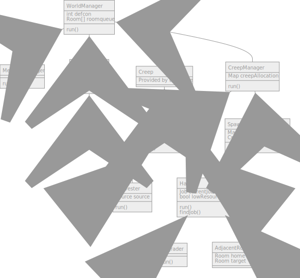

# Screeps bot

I am currently using screeps as an excuse to learn typescript. 
As such, don't expect my bot to be the most performant or even to work.

The template was provided by [screeps-typescript-starter](https://github.com/screepers/screeps-typescript-starter),
and many concepts will probably be reused from the [screeps nooby guide](https://www.youtube.com/watch?v=edBMmOAfJ-Q).

## Design
