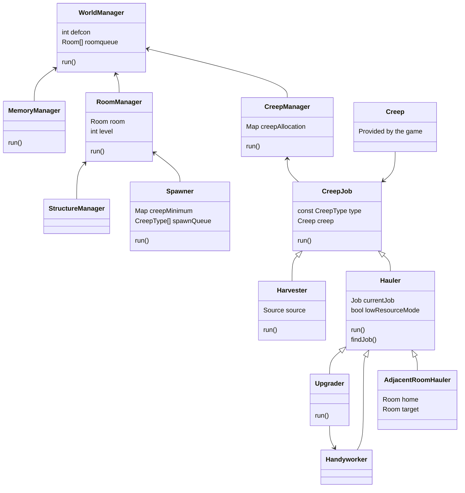

```mermaid
classDiagram
WorldManager <-- MemoryManager
WorldManager <-- RoomManager
WorldManager <-- CreepManager
RoomManager <-- StructureManager
CreepManager <-- CreepJob
RoomManager <-- Spawner
Creep --> CreepJob
CreepJob <|-- Harvester
CreepJob <|-- Hauler
Hauler <|-- Upgrader
Hauler <|-- Handyworker
Upgrader --> Handyworker
Hauler <|-- AdjacentRoomHauler

WorldManager : int defcon
WorldManager : Room[] roomqueue
WorldManager : run()

MemoryManager : run()

Creep : Provided by the game

CreepJob : const CreepType type
CreepJob : Creep creep
CreepJob : run()

RoomManager : Room room
RoomManager : int level
RoomManager : run()

CreepManager : Map creepAllocation
CreepManager : run()

Spawner : Map creepMinimum
Spawner : CreepType[] spawnQueue
Spawner : run()

Harvester : Source source
Harvester : run()

Hauler : Job currentJob
Hauler : bool lowResourceMode
Hauler : run()
Hauler : findJob()

Upgrader : run()

AdjacentRoomHauler : Room home
AdjacentRoomHauler : Room target
```